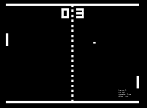

 

Pong is a classic. Pong is the beginning. And Pong is addictive. But I actually played Pong quite late to be honest. My first games were actually on a SNES, and until I got a GameBoy I didn't enjoy joys (heh) like Pong or Snake.

Its mechanic is so simple that is without a dub the simplest to start this project. The last time I tried to do this JS game dev journey I started with Snake, but this time I will start with this. And this time **I will definitely finish the game**. That is something I almost never do.

The **Pong** series will be four or five parts, depending on how long the posts end up being, that have to cover a few things. And this will spin-off another series, the _Game Runner_ that I will build before going into other more complex games.

So without further ado, let's see what I want to do with this one:

* The Game Runner
* The Game Loop
* Boundaries and Bouncing
* AI

This will be the basic gameplay, basic "graphics", and almost nothing else. Thus the V1 of the title. After this is done, and I make some other games, and complete the Game Runner and the State Machine (what is that!?) I will rework this into a V2 with a little more juiciness.

Let's go!